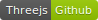
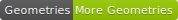
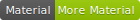
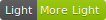

# Threejs
`three.js`是 JavaScript 编写的 `WebGL` 第三方库。
* 使用 `Three.js` 不需要了解太多图形学知识，可以降低学习成本。
* 使用ThreeJS可以用更少的代码实现更多的内容，它屏蔽很多处理细节，提供更多组件，提高开发效率。
* ThreeJS有很高的易用性，但同时也不失灵活性。

`three.js` 最终它会以 `canvas` 的节点呈现在 `html` 上。

#### GibHub 地址

`Github` 里面有很多案例，大家可以去看一下。

[](https://github.com/josdirksen/learning-threejs)

!>学习这门语言，最好要有一点 `Javascript` 功底，对浏览器控制台有一定的认识，这样学起来才会更加容易上手，不那么吃力。<br>
必须要把底层的东西弄懂，弄明白，后面的进度才会比较顺。


## 起步
引入 `three.js`

```copy
<script type="text/javascript" src="js/three.js"></script>
```

## 基础的三大元素
在 `Three.js` 中必须要有三样东西，才可以将物体渲染到页面当中去。

* `scene 场景`：场景是一个容器，我们所要看到的，展示的东西都会存放在这个场景中。<br>
* `camera 相机`：相机让我们能够在渲染好的场景中看到内容。<br>
* `renderer 渲染器`：渲染器负责计算制定的相机角度下，场景呈现的效果。

#### scene-场景
`new THREE.Scene()` 这个函数对象本身没有太多的选项和方法。

>当你想设置 `几何图形` 或者 `灯光` ... 的时候，你可能需要添加到场景中 `scene.add()`;

#### camera-相机
`new THREE.PerspectiveCamera(fov, aspect, near, far)` 这个函数里面有4个参数。

###### 参数描述
* fov：可视角度；`可视角度越小看到的物体越大`
* aspect：`canvas` 的长宽比；
* near：近距离的值；`小于 near 的值的物体不会被渲染`
* far：远距离的值；`大于 far 的值的物体不会被渲染`

>`PerspectiveCamera` 是透视相机，`Three.js` 里还有其他的相机，后面我们会说到。这个相机一般参数设置是 `new THREE.PerspectiveCamera(75,window.innerWidth/window.innerHeight,.1,1000)` 

###### 坐标属性
* camera.position.x = 20;               //在 `x` 轴向 `右` 方偏移 `20`
* camera.position.y = 20;               //在 `y` 轴向 `下` 方偏移 `20`
* camera.position.z = 20;               //在 `z` 轴向 `上` 方偏移 `20`
* camera.lookAt(scene.position);        //设置视野为中心坐标


#### renderer-渲染器
`new THREE.WebGLRenderer()` 像素级的渲染。

一般渲染器的背景是黑色的，我们可以通过以下的方式改变渲染器的背景颜色。
```copy
renderer.setClearColor(0xffffff,1.0);       
renderer.setClearColor('rgb(255,255,255)',1.0);
renderer.setClearColor('rgba(255,255,255,1)',1.0);
renderer.setClearColor('#fff',1.0);
```
!>`0xffffff` 16进制的色值没有引号

## 立体几何图形
`Three.js` 中，我们使用 `Mesh` 的构造函数来建立模型。

`Mesh` 的构造函数：
```copy
new THREE.Mesh(geometry,material);
```
`geometry`：几何形状<br>
`material`：材质

!>为了 `demo` 展示方便，我这边用了统一的材质体现。关于材质的主题，后续会详细说到。

#### geometry 几何形状
`BoxGeometry`：立方体<br>
`CylinderGeometry`：圆柱体<br>
`SphereGeometry`：球体<br>
`TorusGeometry`：圆环<br>
`TorusKnotGeometry`：圆环结<br>

更多几何形状：

[](https://threejs.docschina.org/#api/geometries/BoxBufferGeometry)

#### BoxGeometry 立方体
语法：
```copy
THREE.BoxGeometry(width, height, dept, widthSegments, heightSegments, depthSegments)
```
`width`：长<br>
`height`：宽<br>
`height`：高<br>
`widthSegments`：长的分段（可忽略，默认 `1`）<br>
`heightSegments`：宽的分段（可忽略，默认 `1`）<br>
`depthSegments`：高的分段（可忽略，默认 `1`）<br>

实例：
```copy
var boxGeometry = new THREE.BoxGeometry(1,1,1);     //立方体设立对应的长宽高
var boxMaterial = new THREE.MeshBasicMaterial({     //材质
    color:'#ffffff',         //设置材质的颜色
    wireframe : true,        //开启材质的渲染线框
})
var boxMesh = new THREE.Mesh(boxGeometry,boxMaterial);
scene.add(boxMesh);
```

<iframe height="265" style="width: 100%;" scrolling="no" title="wOBVPm" src="//codepen.io/biubiubiu/embed/wOBVPm/?height=265&theme-id=0&default-tab=js,result" frameborder="no" allowtransparency="true" allowfullscreen="true">
  See the Pen <a href='https://codepen.io/biubiubiu/pen/wOBVPm/'>wOBVPm</a> by @biu²
  (<a href='https://codepen.io/biubiubiu'>@biubiubiu</a>) on <a href='https://codepen.io'>CodePen</a>.
</iframe>


#### CylinderGeometry-立方体
语法：
```copy
THREE.CircleGeometry(radiusTop,radiusBottom,height,radiusSegments, heightSegments, openEnded)
```
`radiusTop`：顶面半径<br>
`radiusBottom`：底面的半径<br>
`height`：圆柱体的高度<br>
`radiusSegments`：顶面与底面的分段数<br>
`heightSegments`：侧面的分段数<br>
`openEnded`：是否没有顶面和底面，布尔类型，缺省值为false，表示有顶面和底面。

实例：
```copy
var cylinderGeometry = new THREE.CylinderGeometry(2, 2, 4, 18, 3);
var cylinderMaterial = new THREE.MeshBasiMaterial({
    color:'#ffffff',
    wireframe: true
});
var cylinderMesh = new THREE.Mesh(cylinderGeometry,cylinderMaterial)
scene.add(cylinderMesh);
```
<iframe height="265" style="width: 100%;" scrolling="no" title="Jzdjye" src="//codepen.io/biubiubiu/embed/Jzdjye/?height=265&theme-id=0&default-tab=js,result" frameborder="no" allowtransparency="true" allowfullscreen="true">
  See the Pen <a href='https://codepen.io/biubiubiu/pen/Jzdjye/'>Jzdjye</a> by @biu²
  (<a href='https://codepen.io/biubiubiu'>@biubiubiu</a>) on <a href='https://codepen.io'>CodePen</a>.
</iframe>

#### SphereGeometry-球体
语法：
```copy
THREE.SphereGeometry(radius,widthSegments,heightSegments,phiStart, phiLength, thetaStart,thetaLength)
```
`radius`：球体的半径<br>
`widthSegments`：水平方向上分段数。默认值是 8，最小值是 3<br>
`heightSegments`：垂直方向上分段数。默认值是 6，最小值是 2<br>
`phiStart`：水平方向上的起始角,默认值0 <br>
`phiLength`：水平方向上球体曲面覆盖的弧度，默认Math.PI * 2 <br>
`thetaStart`：垂直方向上的起始角， 默认0 <br>
`thetaLength`：垂直方向是球体曲面覆盖的弧度，默认值为Math.PI<br>

实例：
```copy
var sphereGeometry = new THREE.SphereGeometry(5, 32, 32 );
var sphereMaterial = new THREE.MeshBasiMaterial({
    color:'#ffffff',
    wireframe: true
});
var sphereMesh = new THREE.Mesh(sphereGeometry,sphereMaterial)
scene.add(sphereMesh);
```
<iframe height="265" style="width: 100%;" scrolling="no" title="xBGxQB" src="//codepen.io/biubiubiu/embed/xBGxQB/?height=265&theme-id=0&default-tab=js,result" frameborder="no" allowtransparency="true" allowfullscreen="true">
  See the Pen <a href='https://codepen.io/biubiubiu/pen/xBGxQB/'>xBGxQB</a> by @biu²
  (<a href='https://codepen.io/biubiubiu'>@biubiubiu</a>) on <a href='https://codepen.io'>CodePen</a>.
</iframe>


#### TorusGeometry -圆环
语法：
```copy
THREE.TorusGeometry(radius, tube, radialSegments, tubularSegments, arc)
```
`radius`：圆环半径<br>
`tube`：管道半径<br>
`radialSegments`：径向的分段数<br>
`tubularSegments`：管的分段数<br>
`arc`：圆环面的弧度，缺省值为Math.PI * 2<br>

实例：
```copy
var torusGeometry = new THREE.TorusGeometry(2,1,4,16);
var torusMaterial = new THREE.MeshBasicMaterial({
  color:'#ffffff',
  wireframe: true
});
var torusMesh = new THREE.Mesh(torusGeometry,torusMaterial)
scene.add(torusMesh);
```

<iframe height="265" style="width: 100%;" scrolling="no" title="WmvveP" src="//codepen.io/biubiubiu/embed/WmvveP/?height=265&theme-id=0&default-tab=js,result" frameborder="no" allowtransparency="true" allowfullscreen="true">
  See the Pen <a href='https://codepen.io/biubiubiu/pen/WmvveP/'>WmvveP</a> by @biu²
  (<a href='https://codepen.io/biubiubiu'>@biubiubiu</a>) on <a href='https://codepen.io'>CodePen</a>.
</iframe>


我们还可以利用最后一个参数，做出特殊的环形：
```copy
var torusGeometry = new THREE.TorusGeometry(2,1,4,16,Math.PI / 3 * 1.5);
```
<iframe height="265" style="width: 100%;" scrolling="no" title="PLqqby" src="//codepen.io/biubiubiu/embed/PLqqby/?height=265&theme-id=0&default-tab=js,result" frameborder="no" allowtransparency="true" allowfullscreen="true">
  See the Pen <a href='https://codepen.io/biubiubiu/pen/PLqqby/'>PLqqby</a> by @biu²
  (<a href='https://codepen.io/biubiubiu'>@biubiubiu</a>) on <a href='https://codepen.io'>CodePen</a>.
</iframe>

#### TorusKnotGeometry 圆环结
语法：
```copy
THREE.TorusKnotGeometry(radius,tube,radialSegments,tubularSegments, p, q, heightScale)
```
`radius`：圆环半径<br>
`tube`：管道半径<br>
`radialSegments`：径向的分段数<br>
`tubularSegments`：管的分段数<br>
`p`：p\Q:对knot(节)状方式有效,控制曲线路径缠绕的圈数，其中p决定垂直方向的参数（可缺省）<br>
`q`：水平方向的参数（可缺省）<br>
`heightScale`：z轴方向上的缩放，默认值1<br>
实例：
```copy
var torusKnotGeometry = new THREE.TorusKnotGeometry(2, 0.5, 32, 8);
var torusKnotMaterial = new THREE.MeshBasicMaterial({
  color:'#ffffff',
  wireframe: true
});
var torusKnotMesh = new THREE.Mesh(torusKnotGeometry,torusKnotMaterial)
scene.add(torusKnotMesh);
```
<iframe height="265" style="width: 100%;" scrolling="no" title="vPOORz" src="//codepen.io/biubiubiu/embed/vPOORz/?height=265&theme-id=0&default-tab=js,result" frameborder="no" allowtransparency="true" allowfullscreen="true">
  See the Pen <a href='https://codepen.io/biubiubiu/pen/vPOORz/'>vPOORz</a> by @biu²
  (<a href='https://codepen.io/biubiubiu'>@biubiubiu</a>) on <a href='https://codepen.io'>CodePen</a>.
</iframe>

## 材质
`Three.js` 里的材质蛮多的，这里列举一部分，详细的材质方法点击以下链接查看：

[](https://threejs.docschina.org/#api/materials/LineBasicMaterial)


`MeshBasicMaterial`：为几何体赋予一种简单的颜色，或者显示几何体的线框 <br>
`MeshDepthMaterial`：根据网格到相机的距离，该材质决定如何给网格染色 ;<br>
`MeshNormalMaterial`：根据物体表面的法向量计算颜色 ;<br>
`MeshFaceMaterial`：这是一种容器，可以在该容器中为物体的各个表面上设置不同的颜色;<br>
`MeshLambertMaterial`：考虑光照的影响，可以创建颜色暗淡，不光亮的物体;<br>
`MeshPhongMaterial`：考虑光照的影响，可以创建光亮的物体 ;<br>
`ShaderMaterial`：使用自定义的着色器程序，直接控制顶点的放置方式，以及像素的着色方式。<br>
`LineBasicMaterial`：可以用于THREE.Line几何体，从而创建着色的直线;<br>
`LineDashedMaterial`类似与基础材质，但可以创建虚线效果;

## 灯光
`Three.js` 中存在点光源和聚光灯两种类型。

`Three.js` 可以设置 `点光源(Point Light)`，`聚光灯(Spot Light)`，`平行光源(Direction Light)`，`环境光(Ambient Light)`。

[](https://threejs.docschina.org/#api/materials/LineBasicMaterial)

`点光源( PointLight )`：向四面八方发射的单点光源<br>
`聚光灯( SpotLight )`：发射出锥形状的光， 模拟手电筒，台灯等光源<br>
`平行光( DirectinalLight )`：平行的一束光，模拟从很远处照射的太阳光<br>
`环境光( AmbientLight )`：笼罩在整个空间无处不在的光


语法：
```copy
Light(color: Integer,intensity: Float);
```
`color`：颜色，默认是十六进制的写法。<br>
`intensity`：强度，默认为 `1`。

实例：

在场景中放置一个球，场景中有灯光，球手灯光的影响有阴暗效果：

>因为场景中的球收到灯光的影响，根据上面的材质列表，`MeshLambertMaterial` 可能会比较适合我们。

```copy
var light = new THREE.DictionalLight('#ffffff',1.0,0);
light.position.set(200,200,200);
scene.add(light);
```

<iframe height="265" style="width: 100%;" scrolling="no" title="Mxwwxb" src="//codepen.io/biubiubiu/embed/Mxwwxb/?height=265&theme-id=0&default-tab=js,result" frameborder="no" allowtransparency="true" allowfullscreen="true">
  See the Pen <a href='https://codepen.io/biubiubiu/pen/Mxwwxb/'>Mxwwxb</a> by @biu²
  (<a href='https://codepen.io/biubiubiu'>@biubiubiu</a>) on <a href='https://codepen.io'>CodePen</a>.
</iframe>